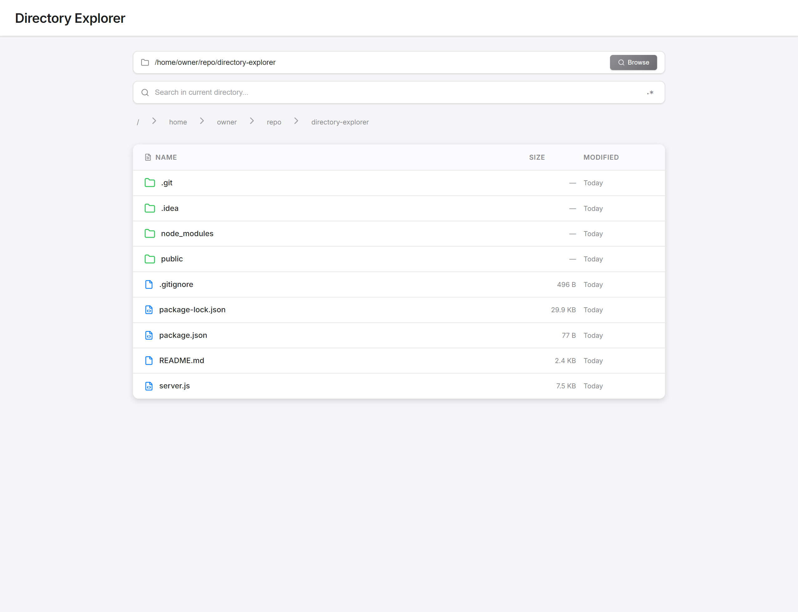

# Directory Explorer

Browse local directories, search filenames and preview files through a browser. A small Express server supplies filesystem data to a JavaScript interface with breadcrumbs, file previews and optional regular-expression search.



## Intended use

This is a personal local utility, not an authenticated document portal. It can read any path accessible to the account running Node. There is no per-user authorization, root-directory sandbox or production deployment configuration.

The server listens on `127.0.0.1` so it is reachable from this machine by default. Do not expose it through a public proxy or use it to serve a shared filesystem. The UI also loads third-party fonts, icons and highlighting assets; it is not a fully offline bundle.

## Run

Requirements: Node.js and npm.

```bash
git clone https://github.com/that-guy-scott/directory-explorer.git
cd directory-explorer
npm ci
npm start
```

Open [http://127.0.0.1:10000](http://127.0.0.1:10000). Enter an absolute directory path, browse the results, or search by filename. Click a file for its preview.

To choose another port:

```bash
PORT=10001 npm start
```

## API

| Route | Purpose |
| --- | --- |
| `GET /api/health` | Process health and uptime. |
| `GET /api/files/*` | List a requested directory. |
| `GET /api/search/*` | Search names under a directory, with optional regex matching. |
| `GET /api/file/*` | Read metadata/content for a requested file. |

Filesystem work uses synchronous Node APIs. Large directories or recursive searches can block other requests. This tradeoff is appropriate to understand before extending it for another environment.

## Code and verification

[server.js](server.js) implements the API; [public/script.js](public/script.js) implements the browser interactions. Additional screenshots are [here](img_1.png) and [here](img_2.png).

```bash
node --check server.js
node --check public/script.js
```

The portfolio cleanup also checks startup, health and file browsing with an isolated temporary fixture. See [verification notes](docs/verification.md). There is no claim of production hardening or a comprehensive test suite.
